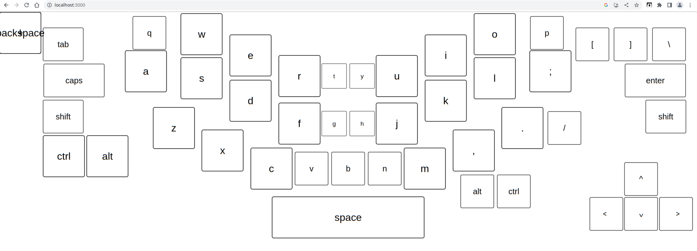

06/16/2023

10:08 AM

dang I'm tired... woke up and didn't sleep much

always workin... slavin'... everyday...

going to work on this, started designing the layout, it's like one of those ergonomic keyboards but worse

10:20 AM

my fingers rest naturally like this

Designed on a 13" foldable laptop to tablet eg. Samsung Galaxy Chromebook 4K

10:26 AM

My plan is to store the key position/rotations and then render them, double function in object lookup

I'm not interested in a full keyboard experience, just the major stuff, it's mostly for writing but supports code writing too (symbols)

The reason I'm making this is currently my Chromebook running Manjaro Linux won't trigger a keyboard while in tablet mode so I'll have this keyboard built into my web app.

11:52 AM

my scuffed alignment view

11:58 AM

this project may have a flaw already, single clicks

maybe it's not noticeable but so far I'm noticing it lol even with just two keys

12:19 PM

losing steam, feeling of dread in my mind

12:22 PM

THEY KILLED MY WIFE AND MY BABY!!! (Megadeth)

ugh man whatever

12:25 PM

hmm... the rapid clicks moves windows around/interpretted as gestures

12:41 PM

this is kind of fun making an interface, I want to add a sound to it too

ugh... but the rapid typing triggers some gesture (minimizes chromium)

1:03 PM

lol wtf is this

1:11 PM

I just realized there's no room for the numbers... so I'll go for a toggle to show a row of numbers

1:31 PM

I think the keys are a tad too big :(

1:43 PM

oh man this keyboard is scuffed

1:57 PM

back on quick snack break

2:17 PM

I have to make the largest dimension a little smaller/shift things around

I think sicne backspace is on the same line as numbers, I will just add the numbers

It's funny I might have to sell this laptop for money anyway lol

Despite designing apps around it

ASTRA man... I'm down 80% on that lol

2:20 PM

this is going to suck this down scale

2:37 PM

generally it's 10% down, 2% across

2:40 PM

cat distraction

3:18 PM

it might be defeat but I may just build a conventional design in order to get this done soon

3:38 PM

distracted, plugged in an external monitor to speed it up, was switching virtual desktops

3:43 PM

It is arguable it would be easier to use flex to design this keyboard vs. manual positioning

However I was initially trying to do the ergonomic style
