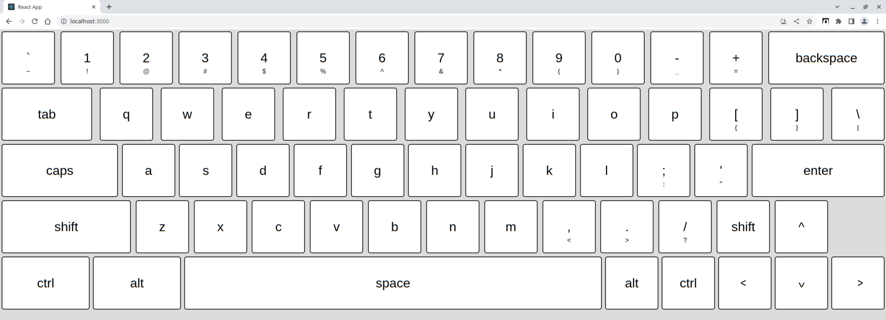
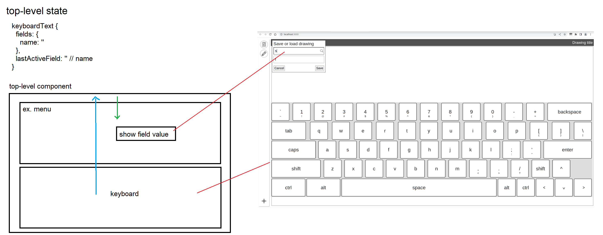

### About

A basic browser on-screen keyboard

Designed around 2194px x 1115px screen

### How to use

See integration example [here](https://github.com/jdc-cunningham/cross-platform-app/blob/latest/desktop/reactjs/src/App.js#L6)

### Demo

### Note

This does not use keyboard events
